Predicting Basketball Possession Outcomes Using Optical Tracking Data
========================================================
author: Dan Cervone
date: November 2, 2015
transition: none

New Insights from Basketball Possessions
====================================================
title: false

</img>

Traditional Basketball Analytics
================================

Based on "box score" data:
- Made/missed shots.
- Assists.
- Rebounds, blocks, steals, turnovers, fouls.

Limitations:
- Data misses meaningful actions and events.
- Players depend on teammates.
- Actions analyzed out of context.

Box Score Data
================================

<a href="http://on.nba.com/1L1JHJO" target="_blank">Example possession</a>

What's in the box score:
- Made shot by LeBron James.
- Assist by Rashard Lewis.

What's missing:
- Norris Cole's dribble penetration.
- Characterization of defense.
- LeBron James' dribble penetration.

NBA Optical Tracking Data
========================================================

NBA Optical Tracking Data
===============================

Installed in 2013, tracks:
 - $latex (x,y)$ locations of all 10 players
 - $latex (x,y,z)$ locations of ball
 - 25 observations per second

About 1 billion space-time points per season

****************

  

Expected Possession Value (EPV)
==================================

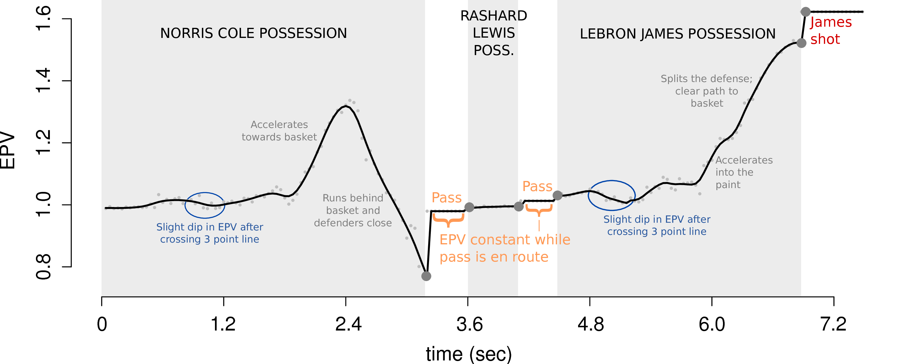

EPV Definition
==========================
<small>
Let $\Omega$ be the space of all possible basketball possessions. For $\omega \in \Omega$
 - $X(\omega) \in \{0, 2, 3\}$: point value of possession $\omega$.
 - $T(\omega)$: possession length
 - $Z_t(\omega), 0 \leq t \leq T(\omega)$: time series of optical tracking data.
 - $\mathcal{F}^{(Z)}_t = \sigma(\{Z_s^{-1}: 0 \leq s \leq t\})$: natural filtration.
</small>

<b>Definition:</b> The <i>expected possession value</i> (EPV) at time $t \geq 0$ during a possession is $\nu_t = \mathbb{E}[X|\mathcal{F}^{(Z)}_t]$. 

<small>

 - EPV provides an instantaneous snapshot of the possession's value, given its full spatiotemporal history.
 - $\nu_t$ is a Martingale:  $\mathbb{E}[\nu_{t + h} | \mathcal{F}^{(Z)}_t] = \nu_t$ for all $h > 0$.
 </small>

Calculating EPV
===========================
<small>
Regression-type prediction (points versus possession features):
<small>
- Data are not traditional input/output pairs.
- No guarantee of stochastic consistency.
</small>

Markov chains (discretizing $Z_t$):
<small>
 - Information is lost through discretization.
 - Many rare transitions.
</small>

Brute force, ``God model'' for basketball:
<small>
 - $\mathbb{P}(Z_{t + \epsilon} | \mathcal{F}^{(Z)}_t)$ full-resolution transition Kernel.
 - Allows Monte Carlo calculation of $\nu_t$ by simulating future possession paths.
 - $Z_t$ is high dimensional and includes discrete events (passes, shots, turnovers).
 
</small></small>

A Coarsened Process
============================
Finite collection of states, $\mathcal{C}$
 - $C_t \in \mathcal{C}$: state of the possession at time $t$.
 - Observable states: $C_t = h(Z_t)$.
 - $C^{(0)}, C^{(1)}, \ldots, C^{(K)}$: discrete sequence of distinct states.

State Space
============================
left: 60%

$\mathcal{C}_{\text{poss}}$: Ball possession states
<small><small>
{player} $\times$ {region} $\times$ {defender within 5 feet}
</small></small>

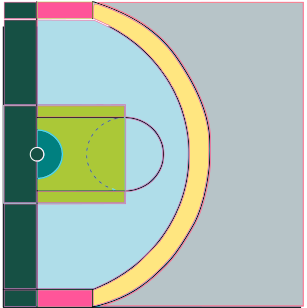

**************
$\mathcal{C}_{\text{trans}}$: Transition states
<small><small>
{{pass linking $c, c' \in \mathcal{C}_{\text{poss}}$ },   {shot attempt from $c \in \mathcal{C}_{\text{poss}}$},   turnover in progress,    rebound in progress }
</small></small>

$\mathcal{C}_{\text{end}}$: End states
<small><small>
{made 2, made 3, turnover}
</small></small>

$$\mathcal{C} = \mathcal{C}_{\text{poss}} \cup \mathcal{C}_{\text{trans}} \cup \mathcal{C}_{\text{end}}$$

Possible Paths for C
========================

Some useful stopping times:
 
 
$$
\begin{align*}
\color{blue}{\tau_t} &= \begin{cases}
\text{min} \{ s : s > t, C_s \in \mathcal{C}_{\text{trans}}\} & \text{if } C_t \in \mathcal{C}_{\text{poss}} \\
t & \text{if } C_t \not \in \mathcal{C}_{\text{poss}}
\end{cases} \\

\color{red} {\delta_t}  &= \text{min}\{s : s \geq \tau_t, C_s \not \in \mathcal{C}_{\text{trans}} \}
\end{align*}$$

Stopping Times for Switching Resolutions
=======================
$$
\begin{align*}
\color{blue}{\tau_t} &= \begin{cases}
\text{min} \{ s : s > t, C_s \in \mathcal{C}_{\text{trans}}\} & \text{if } C_t \in \mathcal{C}_{\text{poss}} \\
t & \text{if } C_t \not \in \mathcal{C}_{\text{poss}}
\end{cases} \\

\color{red} {\delta_t}  &= \text{min}\{s : s \geq \tau_t, C_s \not \in \mathcal{C}_{\text{trans}} \}
\end{align*}$$
 
Key assumptions:
- (A1) $C_t$ is marginally semi-Markov.
- (A2) For all $s > \delta_t$, $\mathbb{P}(C_s | C_{\delta_t}, \mathcal{F}^{(Z)}_t) = \mathbb{P}(C_s | C_{\delta_t})$.

Assume (A1)--(A2), then for all $0 \leq t < T$, 
 
 
$$\nu_t = \sum_{c \in \{ \mathcal{C}_{\text{trans}} \cup \mathcal{C}_{\text{end}} \}} \mathbb{E}[X | C_{\delta_t} = c]\mathbb{P}(C_{\delta_t} = c | \mathcal{F}^{(Z)}_t).$$

Multiresolution Models
=======================
$$\nu_t = \sum_{c \in \{ \mathcal{C}_{\text{trans}} \cup \mathcal{C}_{\text{end}} \}} \mathbb{E}[X | C_{\delta_t} = c]\mathbb{P}(C_{\delta_t} = c | \mathcal{F}^{(Z)}_t).$$
Let $M(t)$ be the event $\{\tau_t \leq t + \epsilon\}$.
<small><small>
- (M1) &nbsp; $\mathbb{P}(Z_{t + \epsilon} | M(t)^c, \mathcal{F}^{(Z)}_t)$: the microtransition model.
- (M2) &nbsp; $\mathbb{P}(M(t) | \mathcal{F}^{(Z)}_t)$: the macrotransition entry model.
- (M3) &nbsp; $\mathbb{P}(C_{\delta_t} | M(t), \mathcal{F}^{(Z)}_t)$: the macrotransition exit model.
- (M4) &nbsp; $\mathbf{P}$, with &nbsp; $P_{qr} = \mathbb{P}(C^{(n+1)} = c_r | C^{(n)} = c_q)$: the Markov transition probability matrix.
</small></small>

Monte Carlo computation of $\nu_t$:
<small>
- Draw &nbsp; $C_{\delta_t} | \mathcal{F}^{(Z)}_t$ using (M1)--(M3).
- Calculate $\mathbb{E}[X | C_{\delta_t}]$ using (M4).
</small>

Microtransition Model
================================
Player $\ell$'s position at time $t$ is $\mathbf{z}^{\ell}(t) = (x^{\ell}(t), y^{\ell}(t))$.
 
 
$$x^{\ell}(t + \epsilon) =  x^{\ell}(t) + \alpha^{\ell}_x[x^{\ell}(t) - x^{\ell}(t - \epsilon)] + \eta^{\ell}_x(t)$$

- $\eta^{\ell}_x(t) \sim \mathcal{N} (\mu^{\ell}_x(\mathbf{z}^{\ell}(t)), (\sigma^{\ell}_x)^2)$.
- $\mu_x$ has Gaussian Process prior.
- $y^{\ell}(t)$ modeled analogously (and independently). 
- Different parameters for all players, offense (ball carrier or not) and defense. 

Microtransition model for defensive players uses inferred defensive matchups from Franks et al. (2014).

Microtransition Acceleration Effects
==============================
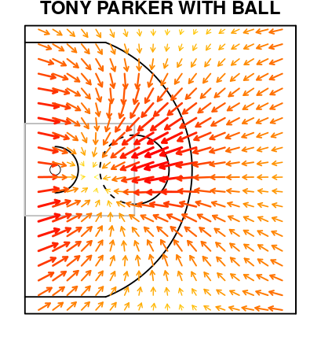
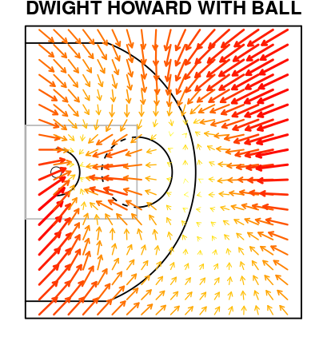

Microtransition Acceleration Effects
==============================
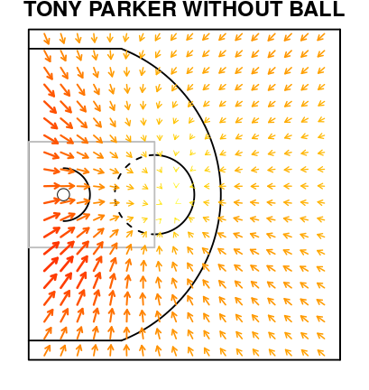
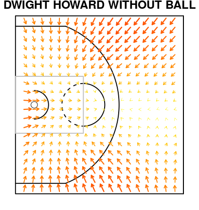

Macrotransition Entry Model
================================
Recall &nbsp; $M(t) = \{ \tau_t \leq t + \epsilon \}$:
- Six different "types"", based on entry state &nbsp; $C_{\tau_t}, \cup_{j=1}^6 M_j(t) = M(t)$.
- Hazards: &nbsp; $\lambda_j(t) = \lim_{\epsilon \rightarrow 0} \frac{\mathbb{P}(M_j(t) | \mathcal{F}^{(Z)}_t)}{ \epsilon}$.

$$\log(\lambda_j(t)) = [\mathbf{W}_j^{\ell}(t)]'\boldsymbol{\beta}_j^{\ell} + \xi_j^{\ell}\left(\mathbf{z}^{\ell}(t)\right)$$

- $\mathbf{W}_j^{\ell}(t), \boldsymbol{\beta}_j^{\ell}$: time-varying covariates and coefficients.
- $\xi_j^{\ell}$: spatial effect on log-hazard.

Competing risks: Prentice et al. (1978)

Spatial Effects
========================
left: 33%
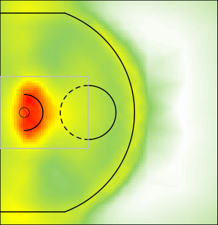
LeBron James' shot-taking &nbsp; $\xi$

**********************
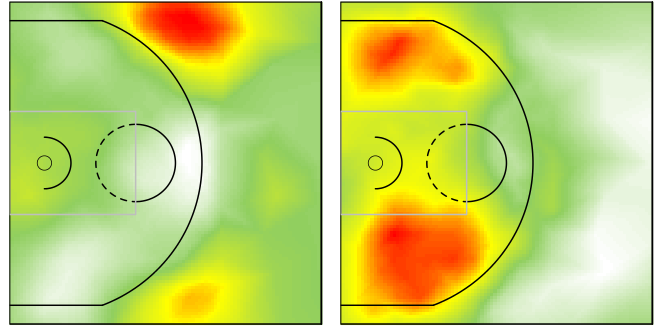
LeBron James' pass (to Center) &nbsp; $\xi$

Hierarchical Modeling
=========================
left: 60%

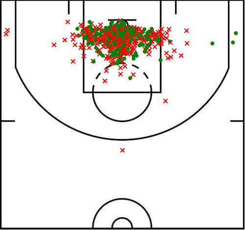
Made/missed shots, 2013-14 season

*******************

Dwight Howard

Hierarchical modeling
=======================
Shrinkage needed:
- Across space.

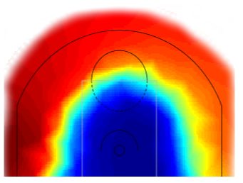

*******************
&nbsp;
- Across different players.

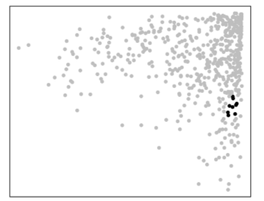

Basis Representation of Spatial Effects
===========================
<small>
Spatial effects $\xi^{\ell}_j$
<small>
- $\ell$: ballcarrier identity.
- $j$: macrotransition type (pass, shot, turnover). 
</small>

Functional basis representation: $\xi^{\ell}_j (\mathbf{z}) = [\mathbf{w}^{\ell}_j]'\boldsymbol{\phi}_j(\mathbf{z})$.
<small>
- $\boldsymbol{\phi}_j = (\phi_{ji} \: \: \ldots \phi_{jd})'$: &nbsp; $d$ spatial basis functions.
- $\mathbf{w}_j^{\ell}$: weights/loadings.
</small>

Information sharing:
<small>
- $\boldsymbol{\phi}_j$ allows for non-stationarity, correlations between disjoint regions 
- $\mathbf{w}_j^{\ell}$: weights across players follow a CAR model  based on player similarity graph $\mathbf{H}$.
</small>

Non-stationarity through basis representation: Higdon (2002)  
Conditional Autoregressive Model: Besag (1974)

</small>

Bases for Hierarchical Models
===================================
left: 25%
<small><small>
- Basis functions $\boldsymbol{\phi}_j$ &nbsp; learned in pre-processing step:

&nbsp;
 
 

- Graph $\mathbf{H}$ &nbsp; learned from players' court occupancy distribution:

</small></small>

***********************
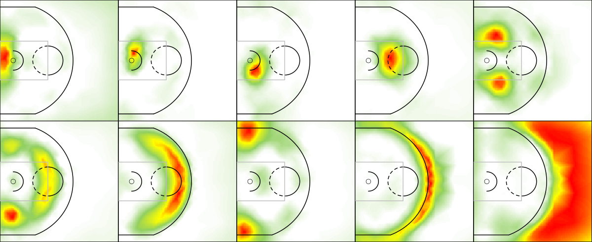
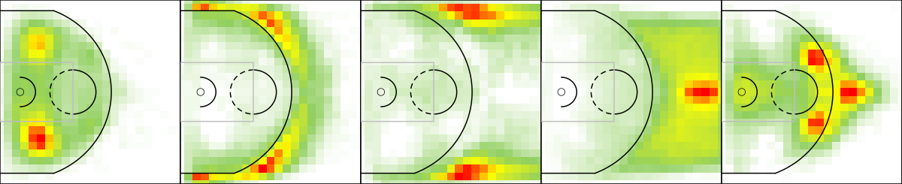

Inference
=====================
<small>
``Partially Bayes'' estimation of all model parameters:
- Multiresolution transition models provide partial likelihood factorization
- All model parameters estimated using R-INLA software 

Distributed computing implementation:
- Preprocessing involves low-resource, highly parallelizable tasks.
- Parameter estimation involves several CPU- and memory-intensive tasks.
- Calculating EPV from parameter estimates involves low-resource, highly parallelizable tasks.

Partial Likelihood: Cox (1975)  
INLA: Rue et al. (2009); Lindgren et al. (2011)

</small>

New Insights from Basketball Possessions
========================

New Insights from Basketball Possessions
====================================================
title: false

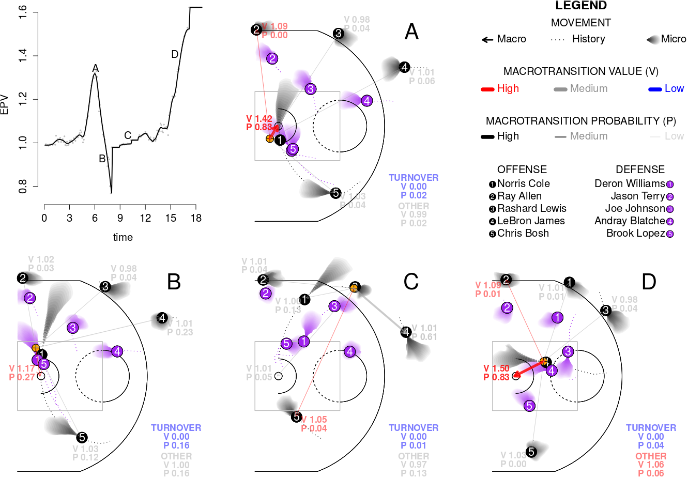</img>

New Metrics for Player Performance
=========================================

<small>
EPV-Added: Top 10 and bottom 10 players by EPV-added (EPVA) per game in 2013-14, minimum 500 touches during season.
</small>
<table style="border:1px solid #ffffff ;" border="0" cellspacing="0" cellpadding="0">
<tr>
<td>
<table style="border:1px solid #ffffff ;" border="0" cellspacing="0" cellpadding="0">
<th>Rank</th> <th> Player </th><th> EPVA </th>
<tr><td>1 </td><td> Kevin Durant </td><td> 3.26 </td></tr>
<tr><td>2 </td><td> LeBron James </td><td> 2.96 </td></tr>
<tr><td>3 </td><td> Jose Calderon </td><td> 2.79 </td></tr>
<tr><td>4 </td><td> Dirk Nowitzki </td><td> 2.69 </td></tr>
<tr><td>5 </td><td> Stephen Curry </td><td> 2.50 </td></tr>
<tr><td>6 </td><td> Kyle Korver </td><td> 2.01 </td></tr>
<tr><td>7 </td><td> Serge Ibaka </td><td> 1.70 </td></tr>
<tr><td>8 </td><td> Channing Frye </td><td> 1.65 </td></tr>
<tr><td>9 </td><td> Al Horford </td><td> 1.55 </td></tr>
<tr><td>10 </td><td> Goran Dragic </td><td> 1.54 </td></tr>
</table>
</td>
<td>
<table style="border:1px solid #ffffff ;" border="0" cellspacing="0" cellpadding="0">
<th>Rank</th> <th> Player </th><th> EPVA </th>
<tr><td>277 </td><td> Zaza Pachulia </td><td> -1.55 </td></tr>
<tr><td>278 </td><td> DeMarcus Cousins </td><td> -1.59 </td></tr>
<tr><td>279 </td><td> Gordon Hayward </td><td> -1.61 </td></tr>
<tr><td>280 </td><td> Jimmy Butler </td><td> -1.61 </td></tr>
<tr><td>281 </td><td> Rodney Stuckey </td><td> -1.63 </td></tr>
<tr><td>282 </td><td> Ersan Ilyasova </td><td> -1.89 </td></tr>
<tr><td>283 </td><td> DeMar DeRozan </td><td> -2.03 </td></tr>
<tr><td>284 </td><td> Rajon Rondo </td><td> -2.27 </td></tr>
<tr><td>285 </td><td> Ricky Rubio </td><td> -2.36 </td></tr>
<tr><td>286 </td><td> Rudy Gay </td><td> -2.59 </td></tr>
</table>
</td>
</tr>
</table>

New Metrics for Player Performance
=========================================

<small>Shot satisfaction: Top 10 and bottom 10 players by shot satisfaction in 2013-14, minimum 500 touches during season.
</small>
<table style="border:1px solid #ffffff ;" border="0" cellspacing="0" cellpadding="0">
<tr>
<td>
<table style="border:1px solid #ffffff ;" border="0" cellspacing="0" cellpadding="0">
<th>Rank</th> <th> Player </th><th> Satis. </th>
<tr><td>1 </td><td> Mason Plumlee </td><td> 0.35 </td></tr>
<tr><td>2 </td><td> Pablo Prigioni </td><td> 0.31 </td></tr>
<tr><td>3 </td><td> Mike Miller </td><td> 0.27 </td></tr>
<tr><td>4 </td><td> Andre Drummond </td><td> 0.26 </td></tr>
<tr><td>5 </td><td> Brandan Wright </td><td> 0.24 </td></tr>
<tr><td>6 </td><td> DeAndre Jordan </td><td> 0.24 </td></tr>
<tr><td>7 </td><td> Kyle Korver </td><td> 0.24 </td></tr>
<tr><td>8 </td><td> Jose Calderon </td><td> 0.22 </td></tr>
<tr><td>9 </td><td> Jodie Meeks </td><td> 0.22 </td></tr>
<tr><td>10 </td><td> Anthony Tolliver </td><td> 0.22 </td></tr>
</table>
</td>
<td>
<table style="border:1px solid #ffffff ;" border="0" cellspacing="0" cellpadding="0">
<th>Rank</th> <th> Player </th><th> Satis. </th>
<tr><td>277 </td><td> Garrett Temple </td><td> -0.02 </td></tr>
<tr><td>278 </td><td> Kevin Garnett </td><td> -0.02 </td></tr>
<tr><td>279 </td><td> Shane Larkin </td><td> -0.02 </td></tr>
<tr><td>280 </td><td> Tayshaun Prince </td><td> -0.03 </td></tr>
<tr><td>281 </td><td> Dennis Schroder </td><td> -0.04 </td></tr>
<tr><td>282 </td><td> LaMarcus Aldridge </td><td> -0.04 </td></tr>
<tr><td>283 </td><td> Ricky Rubio </td><td> -0.04 </td></tr>
<tr><td>284 </td><td> Roy Hibbert </td><td> -0.05 </td></tr>
<tr><td>285 </td><td> Will Bynum </td><td> -0.05 </td></tr>
<tr><td>286 </td><td> Darrell Arthur </td><td> -0.05 </td></tr>
</table>
</td>
</tr>
</table>

Acknowledgements and Future Work
==========================

<small>
Our EPV framework can be extended to better incorporate unique basketball strategies:
- Additional macrotransitions can be defined, such as pick and rolls, screens, and other set plays.
- Use more information in defensive matchups (only defender locations, not identities, are currently used).
- Summarize and aggregate EPV estimates into useful player- or team-specific metrics.

Thanks to:
- Luke Bornn, Alex D'Amour, Alex Franks, Kirk Goldsberry, Andrew Miller.
- Moore/Sloan Foundations.
</small>
