

Hierarchical modeling of high-resolution player-tracking data
========================================================
author: (Or, how Bayes and big data bat for the same team)
transition: none
width: 1200
height: 800

Dan Cervone, NYU  
June 14, 2016  
ISBA World Meeting

Joint work with Luke Bornn, Alex D'Amour, Alex Franks, Kirk Goldsberry, Andrew Miller

History of sports analytics
====================================================
left: 50%

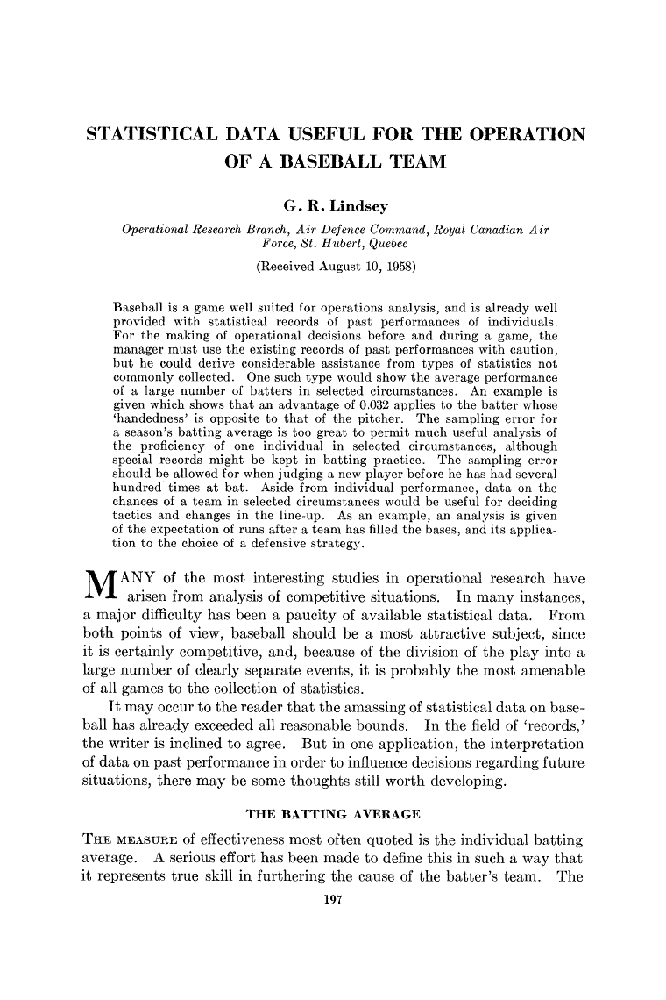</img>

*******

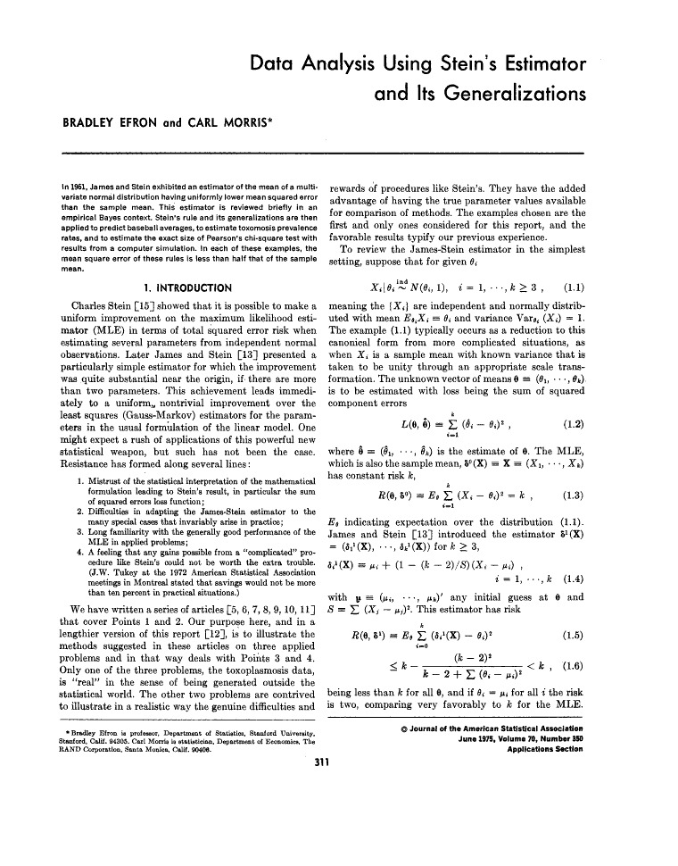</img>

History of sports analytics
====================================================
left: 50%

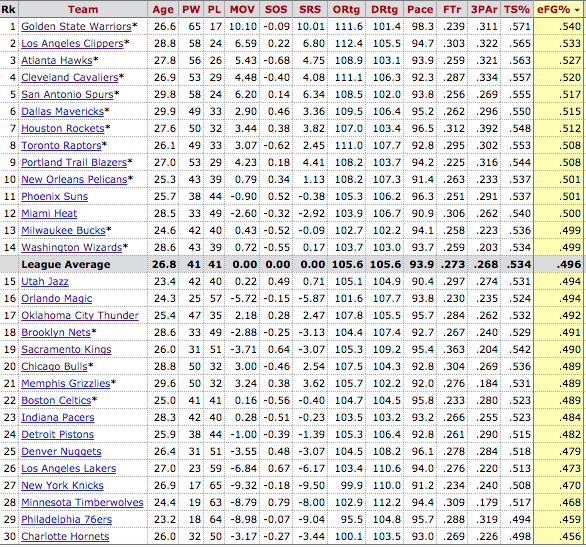

*******

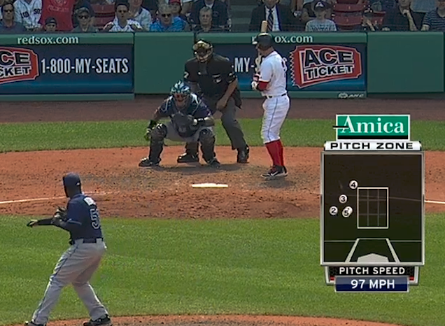

Future of sports analytics
====================================================
left: 50%

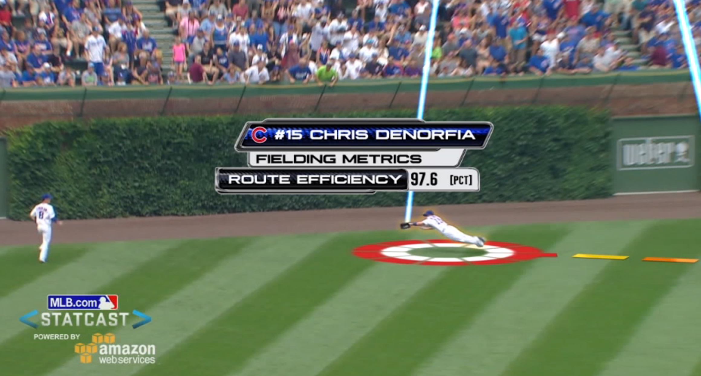

*******

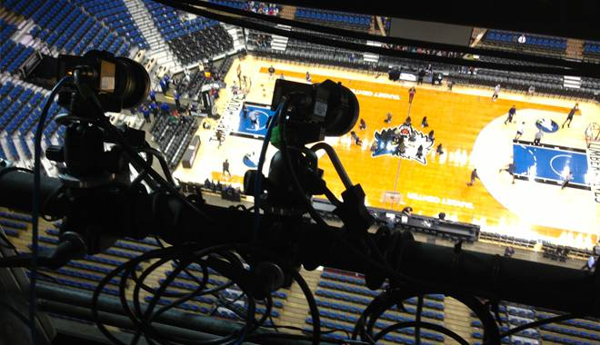

Player tracking data
=================================================
left: 50%

- NBA
 - Since 2013
 - Optical tracking
- MLB
 - Since 2015
 - Optical + radar
- NFL
 - Since 2015
 - Wearable
- Soccer
 - Various systems in various leagues since 2012

***************

Philosophies for modeling tracking data
================================

1. Model the data generating process
 - Features of a DGP map to analytics of interest
 - DGP components can be interchanged and reused to answer new questions

2. Use qualitative and subjective knowledge
 - We're all domain experts when analyzing sports data

3. Hierarchical modeling helps
 - Efron: "enormous data sets often consist of enormous numbers of small sets of data"
 - Sports data have natural hierarchy and structured variation
 - Shrinkage and regularization necessary for useful inferences

Example: NBA Expected Possession Value
=======================================

<small>
Let $\Omega$ be the space of all possible basketball possessions. For $\omega \in \Omega$
 - $X(\omega) \in \{0, 2, 3\}$: point value of possession $\omega$
 - $Z_t(\omega), 0 \leq t \leq T(\omega)$: time series of optical tracking data
 - $\mathcal{F}^{(Z)}_t = \sigma(\{Z_s^{-1}: 0 \leq s \leq t\})$: natural filtration

The expected possession value (EPV) at time $t \geq 0$ is $\nu_t = \mathbb{E}[X|\mathcal{F}^{(Z)}_t]$

</small>

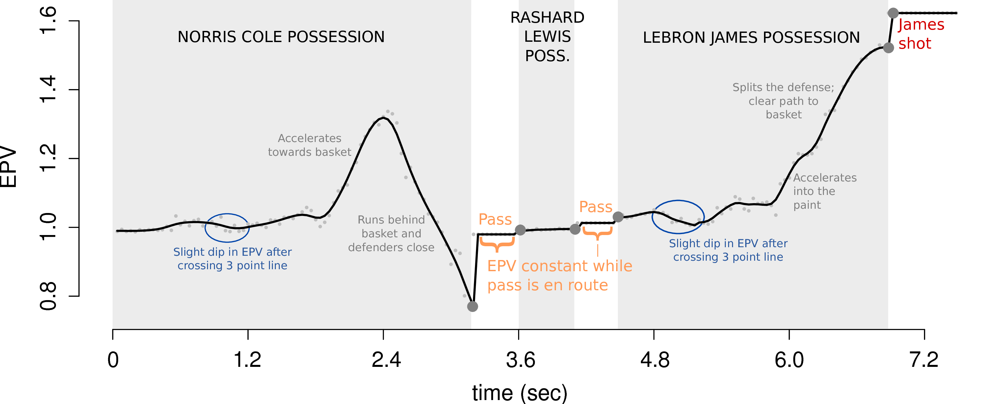

Calculating EPV
===========================

$$\begin{align*}
  \nu_t &= \mathbb{E}[X | \mathcal{F}^{(Z)}_t] \\
   &= \int_{\Omega} X(\omega) \mathbb{P}(d \omega | \mathcal{F}^{(Z)}_t)
\end{align*}$$

Is this a regression-style prediction problem?
 - Data are not traditional input/output pairs
 - No guarantee of stochastic consistency

Stochastic process model for basketball:
 - $\mathbb{P}(Z_{t + \epsilon} | \mathcal{F}^{(Z)}_t)$ full-resolution transition kernel
 - Allows Monte Carlo calculation of $\nu_t$ by simulating future possession paths
 - $Z_t$ is high dimensional and includes discrete events (passes, shots, turnovers)
 

Factoring the DGP
=====================

Let $M(t)$ be the event that an **event** (pass/shot/turnover) occurs in $(t, t + \epsilon]$

Modeling movement and events are separate but complementary tasks:

<small>
$$\begin{align*}
\prod_{t} \mathbb{P}(Z_{t + \epsilon} | \mathcal{F}^{(Z)}_t) & = 
    \Bigg( \prod_{t}  \mathbb{P}(Z_{t + \epsilon}|M(t)^c, \mathcal{F}^{(Z)}_t)^{\mathbf{1}[M(t)^c]} \Bigg)  & \hspace{0cm} \text{(player movement)} \\
    & \times \Bigg( \prod_{t} \mathbb{P}(Z_{t + \epsilon}|M(t), \mathcal{F}^{(Z)}_t)^{\mathbf{1}[M(t)]} \Bigg)    & \hspace{0cm} \text{(player reaction to events)} \\
    
& \hspace{-3cm} \times \Bigg( \prod_{t} \mathbb{P}(M(t)^c | \mathcal{F}^{(Z)}_t)^{\mathbf{1}[M(t)^c]}  \mathbb{P}(M(t)|\mathcal{F}^{(Z)}_t)^{\mathbf{1}[M(t)]} \Bigg)   & \hspace{0cm} \text{(event occurrences)} 
\end{align*}
$$
</small>

Modeling events
================================
Recall &nbsp; $M(t)$ denotes a pass, shot, or turnover in $(t, t + \epsilon]$
- Six different event **types** (4 pass options, shot, turnover), indexed by $j$: $\cup_{j=1}^6 M_j(t) = M(t)$
- Event **hazard**: &nbsp; $\lambda_j(t) = \lim_{\epsilon \rightarrow 0} \frac{\mathbb{P}(M_j(t) | \mathcal{F}^{(Z)}_t)}{ \epsilon}$

$$\log(\lambda_j(t)) = [\mathbf{W}_j^{\ell}(t)]'\boldsymbol{\beta}_j^{\ell} + \xi_j^{\ell}\left(\mathbf{z}^{\ell}(t)\right)$$

- $\ell$ indexes players
- $\mathbf{W}_j^{\ell}(t), \boldsymbol{\beta}_j^{\ell}$: time-varying covariates and coefficients
- $\xi_j^{\ell}$: spatial effect on log-hazard

Spatial effects
========================

 **Shot taking** 

<table width="100%" border="0">
<tr>
<td>
Klay Thompson   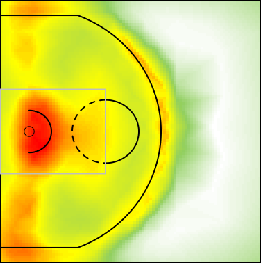
</td>
<td>
LeBron James   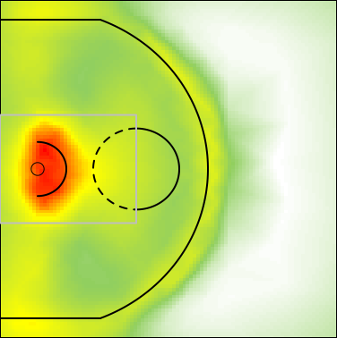
</td>
</tr>
<tr>
<td>
Dwight Howard   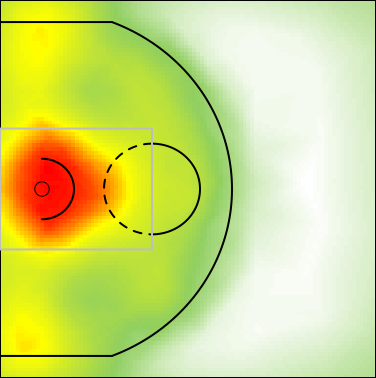
</td>
<td>
Dirk Nowitzki   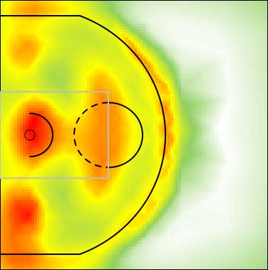
</td>
</tr></table>

Estimating spatial effects
========================
left: 60%

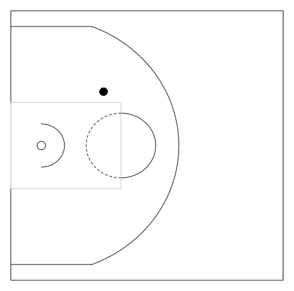

**********************

 
To estimate spatial effect on shot-taking hazard:

Estimating spatial effects
========================
left: 60%

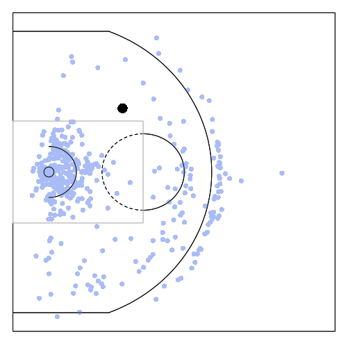

**********************

 
To estimate spatial effect on shot-taking hazard:
- share information across space

Estimating spatial effects
========================
left: 60%

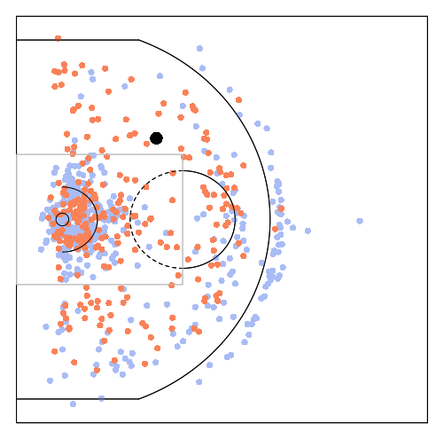

**********************

 
To estimate spatial effect on shot-taking hazard:
- share information across space
- share information between players

Hierarchical spatial modeling
===========================

Functional basis representation: $\xi^{\ell}_j (\mathbf{z}) = [\mathbf{w}^{\ell}_j]'\boldsymbol{\phi}_j(\mathbf{z})$
- $\boldsymbol{\phi}_j = (\phi_{j1} \: \: \ldots \phi_{jd})'$: &nbsp; $d$ spatial basis functions
- $\mathbf{w}_j^{\ell}$: weights/loadings

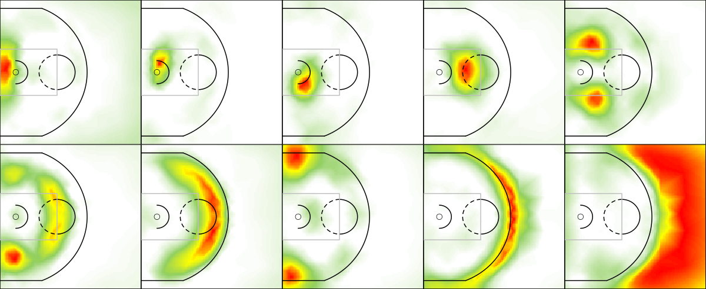

Hierarchical spatial modeling
===========================

Weights $\mathbf{w}_j^{\ell}$ have a conditional autoregressive (CAR) prior
<small>
$$\begin{align*}
\hspace{3cm} \boldsymbol{w}^{\ell}_j | \boldsymbol{w}^{-(\ell)}_j, \tau_{\mathbf{w}_j}^2 &\sim 
 \mathcal{N} \left( \frac{1}{n_{\ell}} \sum_{k : H_{\ell k} = 1} \mathbf{w}^{k}_j, \frac{\tau_{\mathbf{w}_j}^2}{n_{\ell}} \mathbf{I}_d\right) \\
\tau^2_{\mathbf{w}_{j}} &\sim \text{InvGam}(1, 1)
\end{align*}
$$
</small>
 - $\mathbf{H}$ is a player similarity adjacency matrix: $H_{\ell k} = 1$ if players $\ell$ and $k$ are similar
 - $\mathbf{H}$ is learned by distance between two players' court occupancy surfaces
 - CAR prior also used for 

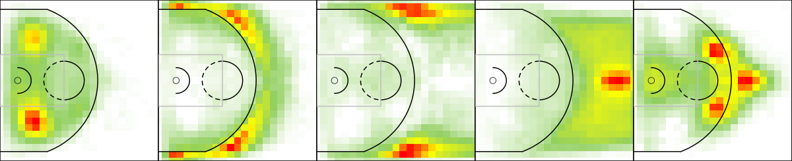

Parameter estimation
=====================

<small>
Preprocessing
- Construct features/covariates from data
- Learn spatial basis functions for each event type 
- Derive player similarity matrix for CAR prior

``Partially Bayes'' estimation of all model parameters:
- Event and movement models inferred separately
- All model parameters estimated using R-INLA software 

Distributed computing implementation:
- Preprocessing involves low-resource, highly parallelizable tasks
- Parameter estimation involves several CPU- and memory-intensive tasks
- Calculating EPV from parameter estimates involves low-resource, highly parallelizable tasks
</small>

New insights from basketball possessions
========================

New insights from basketball possessions
====================================================
title: false

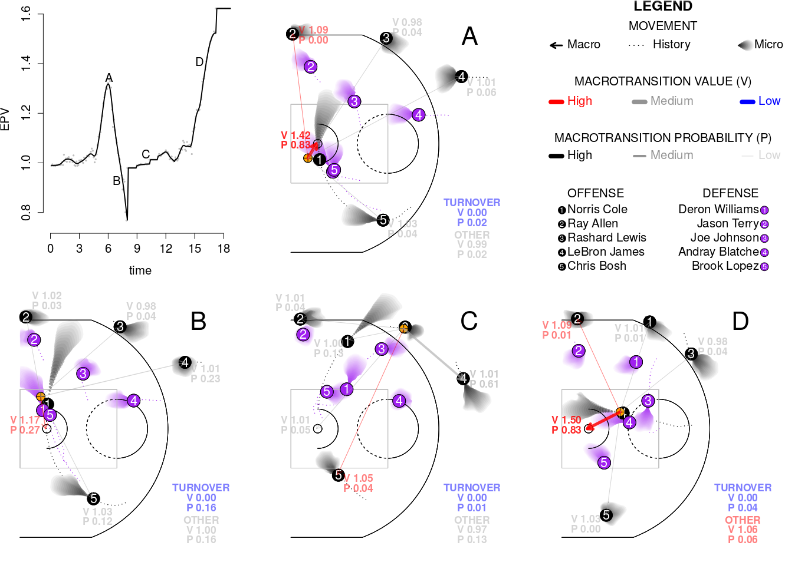</img>

Example: more precise baseball metrics
===============================================

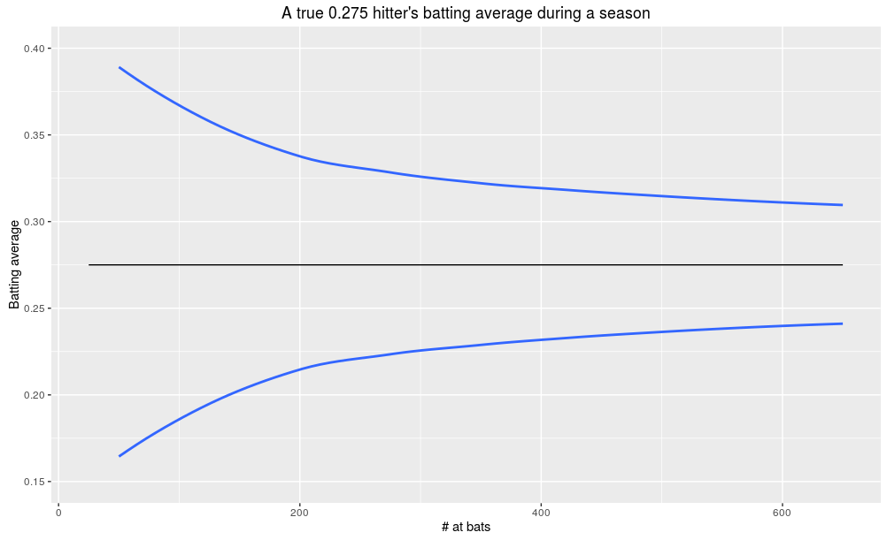

Batting average noise
===============================================

Assume for at-bat $i$ for player $j$: 
- $\mathbb{P}(Y_{ji} = 1 | X_{ji} = x) = p_j(x)$
- Player's **true** batting average is $\mu_j = \mathbb{E}[p_j(X)]$

Traditional batting average is calculated using $\hat{\mu}_j = \frac{1}{n_j}\sum_{i=1}^{n_j} Y_{ji}$

$$\begin{align*}
\mathbb{E}[\hat{\mu}_j] &= \mu_j \\
\mathbb{Var}[\hat{\mu}_j] &= \frac{1}{n_j}(\mathbb{E}[p_j(X)(1 - p_j(X))] + \mathbb{Var}[p_j(X)])
\end{align*}
$$

What if we knew $p_j(X)$?
 - Batted ball trajectory is a sufficient statistic
 
"Expected" batting average
============================================

<small>
Consider **expected** batting average $\mu^E_j = \frac{1}{n_j}\sum_{i=1}^{n_j} p_j(x_i)$
- Rao-blackwellized calculation of tradtional batting average
- $$\begin{align*}
\mathbb{E}[\hat{\mu}^E_j] &= \mu_j \\
\mathbb{Var}[\hat{\mu}^E_j] &= \frac{1}{n_j}\mathbb{Var}[p(X)]
\end{align*}
$$

Thus, $\mathbb{Var}[\hat{\mu}^E_j] = \mathbb{Var}[\hat{\mu}_j] - \frac{1}{n_j}\mathbb{E}[p_j(X)(1 - p_j(X))]$

Many off-the shelf models work great for estimating $p_j(X)$, using batted ball trajectory data
 - BART
 - Random forests
 - GPs
 
Empirically, "expected" batting average yields about 50% variance reduction.

</small>

Trajectory hit probability model
============================================

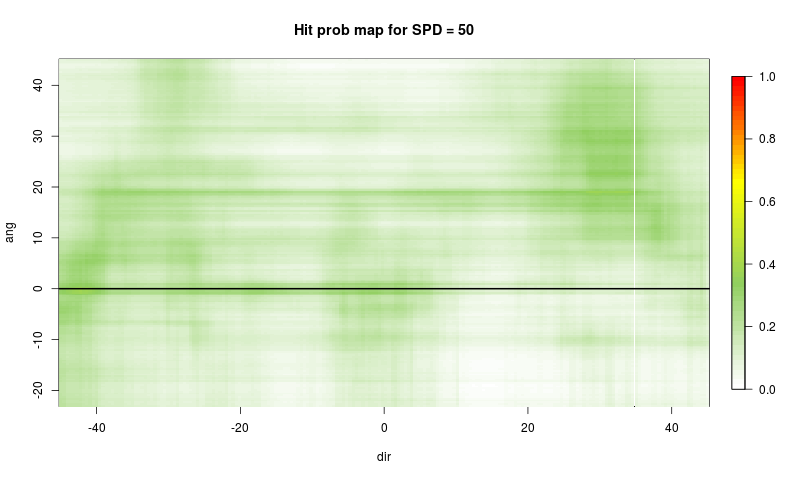

Trajectory hit probability model
============================================

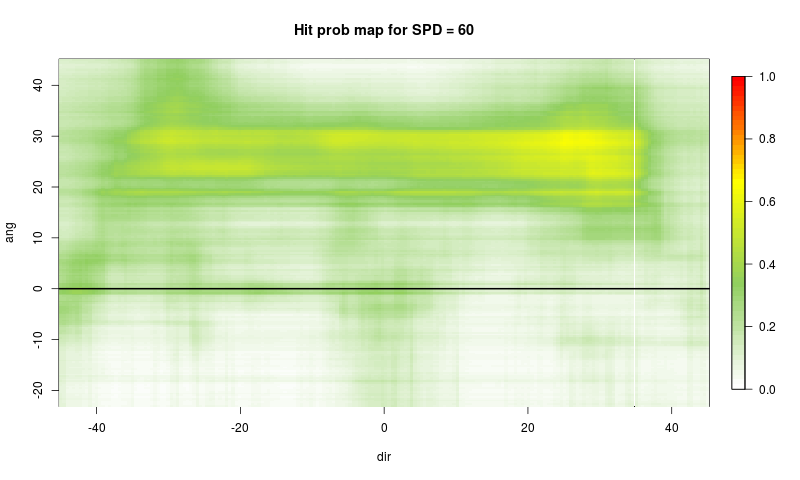

Trajectory hit probability model
============================================

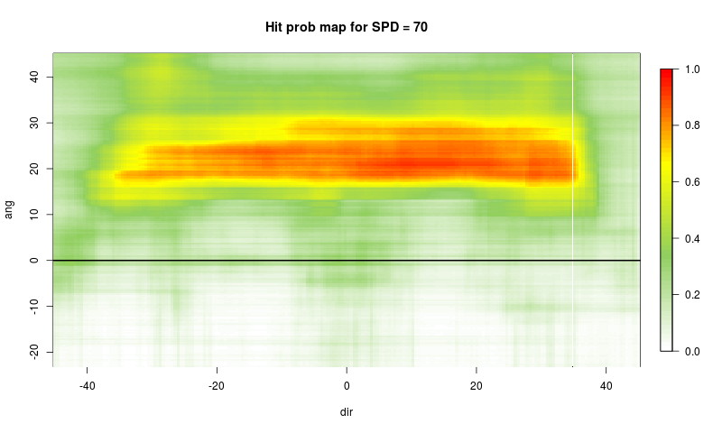

Trajectory hit probability model
============================================

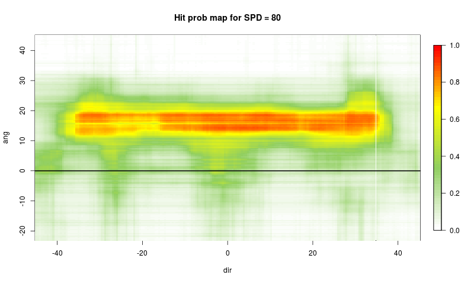

Trajectory hit probability model
============================================

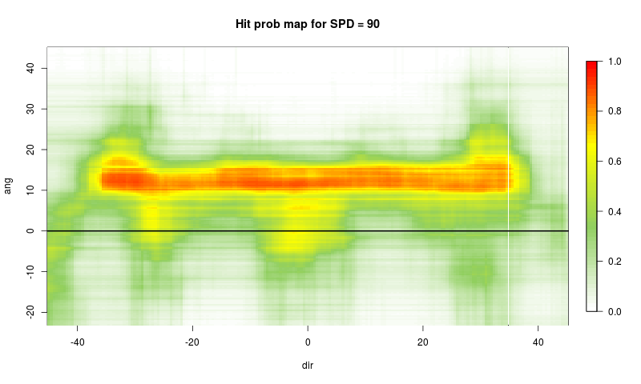

Trajectory hit probability model
============================================

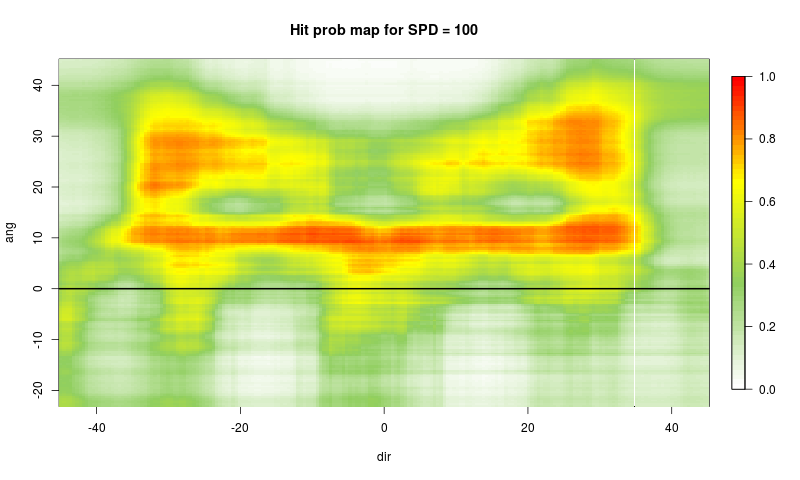

Trajectory hit probability model
============================================

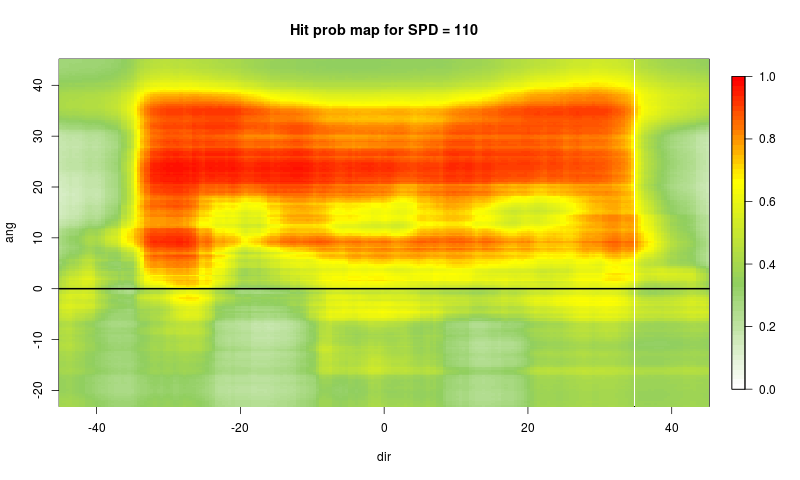

Concluding remarks
==========================

Outstanding challenges in modeling tracking data
- Measurement error
- Data size
- Heterogeneous data sources

Thanks to:
- Luke Bornn, Alex D'Amour, Alex Franks, Kirk Goldsberry, Andrew Miller.
- Moore/Sloan Foundations.

End 1
===============================

End 2
================================

Unpacking batting average
===============================================

<small>
Traditional batting average:
- $\mathbb{P}(Y = 1 | B = \text{Mike Trout})$

Modern adjustments:
- $\mathbb{P}(Y = 1 | B = \text{Mike Trout}, \text{ Park, Pitcher})$

The full DGP?
- Let $i = 1, \ldots, n$ index pitches in the at-bat.
- $$\begin{align*}
\mathbb{P}(Y = 1 | \text{All data}) &= \mathbb{P}(Y = 1 | T_n, F_n) \times \mathbb{P}\left( T_n, F_n| B, S_n, P_n, \mathbf{\{P,S,T\}}_{[1:(n-1)]}\right) \\
& \times \mathbb{P}\left(S_n | B, P_n,  \mathbf{\{P,S,T\}}_{[1:(n-1)]} \right) \\
& \hspace{-3cm} \times \prod_{i=1}^{n-1} \mathbb{P}\left(T_i, F_i| B, S_i, P_i, \mathbf{\{P,S,T\}}_{[1:(i-1)]}\right)
\times \mathbb{P}\left(S_i | B, P_i,  \mathbf{\{P,S,T\}}_{[1:(i-1)]} \right) 
\end{align*}$$

</small>
